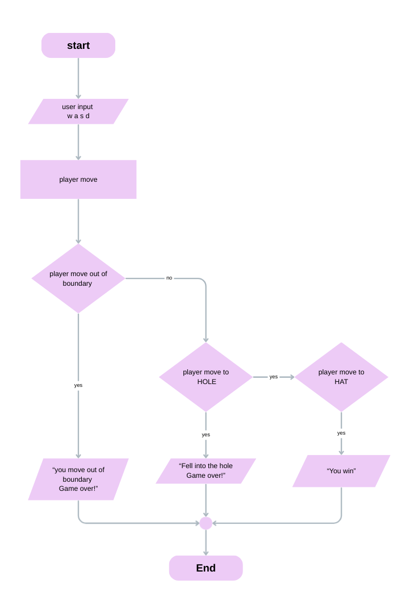

# Thinking Process Guidelines

## Table of Contents

- [Thinking Process Guidelines](#thinking-process-guidelines)
  - [Table of Contents](#table-of-contents)
  - [1. Workflow Planning](#1-workflow-planning)
  - [2.1. Board Functions (Hardcoded)](#21-board-functions-hardcoded)
  - [2.2. Board Functions (Generated)](#22-board-functions-generated)
  - [3. Input Functions](#3-input-functions)
  - [4. Movement Functions](#4-movement-functions)
  - [5. Game Rule Functions](#5-game-rule-functions)
  - [6. Game Play Loop](#6-game-play-loop)
- [WRITE YOUR THINKING PROCESS BELOW. ](#write-your-thinking-process-below)

## <span style="font-weight:bold; color: black; background-color: gold; padding: 0.5rem 2rem;">1. Workflow Planning</span>

↳ Draw a flowchart or write steps describing:

<p style="display: flex; align-items: center; gap: 1rem;">
<span style="font-weight:bold; color: wheat; background-color: blue; padding: 0.5rem 2rem; border-radius: 0.5em;">Game start</span>
<span style="color: wheat; font-weight:bold; font-size:2rem; ">→</span>
<span style="font-weight:bold; color: wheat; background-color: blue; padding: 0.5rem 2rem; border-radius: 0.5em;">Read input</span>
<span style="color: wheat; font-weight:bold; font-size:2rem;">→</span>
<span style="font-weight:bold; color: wheat; background-color: blue; padding: 0.5rem 2rem; border-radius: 0.5em;">Update position</span>
<span style="color: wheat; font-weight:bold; font-size:2rem;">→</span>
<span style="font-weight:bold; color: wheat; background-color: blue; padding: 0.5rem 2rem; border-radius: 0.5em;">Check rules</span>
<span style="color: wheat; font-weight:bold; font-size:2rem;">→</span>
<span style="font-weight:bold; color: wheat; background-color: blue; padding: 0.5rem 2rem; border-radius: 0.5em;">End/Continue</span>
</p>

↳ Must include:

- Input/output of each function.
- Edge cases (invalid input, boundaries, hole/hat tiles).

## <span style="font-weight:bold; color: black; background-color: gold; padding: 0.5rem 2rem; margin-top: 1rem; border-buttom: none;">2.1. Board Functions (Hardcoded)</span>

↳ Prints the hardcoded board in terminal.

<span style="font-weight:bold; color: gold;">Thinking process should explain:</span>

- How the board is represented (2D array).
- Tile types (PLAYER, EMPTY, HOLE, HAT).

## <span style="font-weight:bold; color: black; background-color: gold; padding: 0.5rem 2rem;">2.2. Board Functions (Generated)</span>

↳ Creates a random board with player, hat, and holes.
↳ Prints the board in terminal.

<span style="font-weight:bold; color: gold;">Thinking process should explain:</span>

- How the board is represented (2D array).
- Tile types (PLAYER, EMPTY, HOLE, HAT).
- How random placement avoids overlaps.

## <span style="font-weight:bold; color: black; background-color: gold; padding: 0.5rem 2rem;">3. Input Functions</span>

↳ Reads and validates user input (w, a, s, d).
↳ Logs invalid input.

<span style="font-weight:bold; color: gold;">Thinking process should explain:</span>

- Input/output.
- Edge cases (invalid input, boundaries).
- How player position is updated.

## <span style="font-weight:bold; color: black; background-color: gold; padding: 0.5rem 2rem;">4. Movement Functions</span>

↳ Updates playerRow / playerCol based on the move.

<span style="font-weight:bold; color: gold;">Thinking process should explain:</span>

- Input/output.
- Edge cases (invalid input, boundaries).
- How player position is updated.

## <span style="font-weight:bold; color: black; background-color: gold; padding: 0.5rem 2rem;">5. Game Rule Functions</span>

↳ Checks for out-of-bounds, falling into a hole, or finding the hat.

<span style="font-weight:bold; color: pink;">&nbsp;Game Rules:&nbsp;</span>

- Wins by finding the hat.
- Loses by landing in a hole.
- Loses by moving outside the board.

<span style="font-weight:bold; color: gold;">Thinking process should explain:</span>

- How to determine win/loss conditions.
- Handling messages for win/loss conditions.

## <span style="font-weight:bold; color: black; background-color: gold; padding: 0.5rem 2rem;">6. Game Play Loop</span>

↳ Combine all functions into a playable loop.
↳ Ensure messages appear correctly, board prints at start, and invalid input is handled.

<span style="font-weight:bold; color: gold;">Thinking process should explain:</span>

- How to determine win/loss conditions.
- Handling messages for win/loss conditions
- How to update the board when the player moves.

---

# <p style="display: flex; align-items: center; gap: 0.5em;"><span style="font-weight:bold; color: white; background-color: lightSeaGreen; padding: 0.5rem 2rem;">WRITE YOUR THINKING PROCESS BELOW.</span><span style="font-weight:bold; color: white; background-color: lightSeaGreen; padding: 0.5rem 0;">&nbsp;</span></p>

---

# Thinking Process

## 1.Workflow Planning

## 

## 2.Board Functions (Hardcoded)

Use for...of to iterate through each row of the board.
Each row is still an array.

```bash
for (let row of board) {
  console.log(row);
```

out put

```bash

[ '*', '░', 'O' ]
[ '░', 'O', '░' ]
[ '░', '^', '░' ]

```

so use .join() if you want to convert the array into a readable string before printing.

```bash
  for (let row of board) {
    console.log(row.join(""));
  }
```

out put

```bash
*░O
░O░
░^░
```

## 3.Input Functions

1. he player needs a way to choose a direction

- Use prompt() to ask for w/a/s/d.

2. Check which key was pressed

- "w" = MoveUp()
- "s" = MoveDown()
- "a" = MoveLeft()
- "d" = MoveRight()

3. Handle wrong or invalid input

- if the key is not one of the valid commands, print “Which way?”
- Then call userInput() again to re-ask.

## 4.Movement Functions

These functions control the movement of the player on the game board.

The player's position is stored in

- playerRow = the row index

- playerCol = the column index

Moving simply means increasing or decreasing these values.

```bash
function MoveUp() {
  playerRow--;
}
function MoveDown() {
  playerRow++;
}
function MoveLeft() {
  playerCol--;
}
function MoveRight() {
  playerCol++;
}
```

## 5.Game Rule Functions

Whenever the player moves, must check what they stepped on.
Thenew position must be validated.

- Out-of-bound must be checked first.
  3x3 board:

```bash
row valid = 0, 1, 2

col valid = 0, 1, 2

Allowed number of positions =
playerRow < 0 = Exit top

playerRow >= board.length = Exit bottom

playerCol < 0 = Exit left

playerCol >= board[0].length = Exit right
```

- Each condition is separated into independent if statements.

```bash
 if (board[playerRow][playerCol] === HOLE) {
    console.log("Fell into the hole Game over!");
  }

  if (board[playerRow][playerCol] === HAT) {
    console.log("You win");
  }
```

## 6.Game Play Loop

- There must be a loop that repeats until the game ends. A while loop controls the entire game. If playing is true, the loop executes, and if playing is false, the loop immediately stops.
- The game must display the board first, then printBoard(board) is called at the top of the loop.

```bash
printBoard(board);
```

- It must receive input from players every turn, so it is called userInput() within the loop.

```bash
userInput();
```

- And the game condition, ruleGame(), is called.

```bash
const rule = ruleGame(board, playerRow, playerCol);
```

- You must know what the game rules mean to stop the loop. If ruleGame says win, the game ends, and if ruleGame says lose, the game ends. By taking the value from the return of the function rule Game

```bash
if (rule === "win" || rule === "lose") {
    playing = false;
    break;
```

- If the game doesn't end, update the player positions, which requires placing the PLAYER in a new position on the board.

<!-- Thinking Process -->
<!-- 1. Workflow Planning -->
<!-- 2.1. Board Functions (Hardcoded) -->
<!-- 2.2. Board Functions (Generated) -->
<!-- 3. Input Functions -->
<!-- 4. Movement Functions -->
<!-- 5. Game Rule Functions -->
<!-- 6. Game Play Loop -->

[Back to Table of Contents](#table-of-contents)

---
